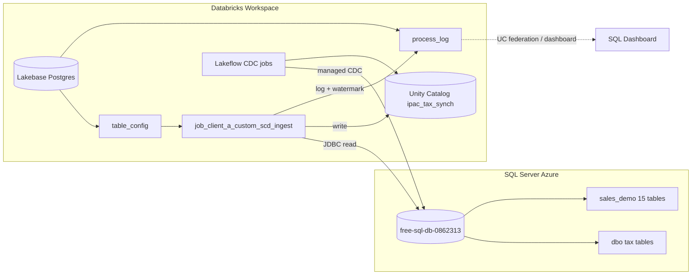

# IPAC Tax Sync

Databricks Asset Bundle (DAB) project for ingesting SQL Server data into Unity Catalog Delta tables, with **Lakebase (Postgres)** as the control plane for table configuration, change-tracking watermarks, and process logging.

Supports two ingestion patterns:

1. **Custom JDBC ingest** — serverless notebooks, SQL Server Change Tracking, SCD1 merge or full overwrite
2. **Lakeflow Connect CDC** — managed ingestion pipelines for integrated CDC (tax `dbo` tables and retail `sales_demo` limited-perm scenarios)

---

## Architecture



### Data flow — custom ingest (`job_client_a_custom_scd_ingest`)

```
Lakebase table_config
        │
        ▼
get_active_tables.py  ──►  for_each (parallel tables)
        │
        ▼
ingest_tables_from_sql_server_to_delta.py  (per table)
        │
        ├── full  → Delta overwrite
        ├── incr  → CT changes → SCD1 merge + deletes
        └── process_log + last_ct_version update in Lakebase
```

**Destination:** `{dest_catalog}.{client_id}_silver_custom.{table_name}`  
Default catalog: `ipac_tax_synch` (bundle variable `dest_catalog`).

---

## Project structure

```
ipac_tax_synch/
├── databricks.yml                 # Bundle root — variables, targets, artifacts
├── pyproject.toml                 # Python package (wheel for Databricks)
├── config/
│   ├── base_config.py             # Lakebase host, dest catalog, shared defaults
│   ├── setup_secrets.sh           # Interactive Databricks secret scope setup
│   └── clients/
│       └── client_a/
│           ├── connection.py      # SQL Server host/db (no passwords in code)
│           └── sql/
│               ├── lakebase/      # DDL, grants, UC federation setup
│               ├── sales_demo_etl_reader_15_tables_ct.sql
│               └── create_table.sql / seed_*.sql
├── resources/jobs/                # DAB job + pipeline definitions
├── src/
│   ├── common/notebook1/          # Active custom ingest notebooks
│   ├── common/notebooks/          # Legacy / experimental notebooks
│   └── utils/
│       ├── secrets.py             # Secret scope + local env resolution
│       ├── common_functions.py    # full_load, scd1_merge
│       ├── lakebase/              # Postgres connection, process_log helper
│       └── sqlserver/             # JDBC read helpers
└── tests/
```

---

## Prerequisites

| Requirement | Notes |
|-------------|--------|
| Databricks workspace with Unity Catalog | Catalog `ipac_tax_synch` |
| Databricks CLI v0.2+ | `databricks auth login --profile prod_w` |
| `uv` | Wheel build (`uv build`) |
| SQL Server (Azure) | Change Tracking enabled on incremental tables |
| Lakebase Postgres | Schema `client_a` with `table_config` + `process_log` |
| Secret scope | `client-a-secrets` in workspace |

---

## Quick start

### 1. Clone and install (local dev)

```bash
cd ipac_tax_synch
uv sync
uv run pytest
```

### 2. Configure Databricks CLI

```bash
databricks auth login --profile prod_w
databricks current-user me --profile prod_w
```

### 3. Create secret scope

```bash
chmod +x config/setup_secrets.sh
./config/setup_secrets.sh --profile prod_w --scope client-a-secrets
```

**Secrets stored:**

| Key | Purpose |
|-----|---------|
| `source-username` / `source-password` | SQL Server read (JDBC) |
| `target-username` / `target-password` | SQL Server write-back (if used) |
| `lakebase-username` / `lakebase-password` | Lakebase Postgres (`client_a_app`) |

Verify:

```bash
databricks secrets list-scopes --profile prod_w
databricks secrets list-secrets client-a-secrets --profile prod_w
```

### 4. Initialize Lakebase (one-time)

Run in **Lakebase SQL editor** as admin:

1. `config/clients/client_a/sql/lakebase/ddl_and_insert.sql` — schema, tables, seed `table_config`
2. `config/clients/client_a/sql/lakebase/grant_client_a_app.sql` — grants for ingest user

### 5. SQL Server setup (as needed)

| Script | When |
|--------|------|
| `config/clients/client_a/sql/create_table.sql` | Tax system DDL |
| `config/clients/client_a/sql/sales_demo_etl_reader_15_tables_ct.sql` | 15-table limited CDC + `etl_reader` grants |

### 6. Deploy bundle

```bash
databricks bundle validate --profile prod_w
databricks bundle deploy --profile prod_w
```

Deploy target: `prod` → `/Workspace/Shared/ipac_tax_synch/prod`

### 7. Run custom ingest (manual)

```bash
databricks bundle run custom_ingest_and_scd_from_sql_server --profile prod_w
```

Or **Run now** on `job_client_a_custom_scd_ingest` in the Workflows UI.

---

## Jobs and pipelines

All jobs use naming convention **`job_{client_id}_*`** and tag **`client_name: client_a`**.

| Workspace name | Bundle key | Description | Schedule |
|----------------|------------|-------------|----------|
| `job_client_a_custom_scd_ingest` | `custom_ingest_and_scd_from_sql_server` | Custom JDBC + SCD1/full overwrite | Manual only |
| `job_client_a_integrated_cdc` | `client_a_integrated_cdc_job` | Lakeflow CDC — 10 tax tables (`dbo`) | Paused (hourly cron defined) |
| `job_client_a_del_con2_integrated_cdc` | `client_a_lakeflow_managed_connect_with_limited_id_job` | Lakeflow CDC — 15 retail tables (`sales_demo`) | Paused |
| `job_client_a_auto_cdc_ingestion_2` | `auto_cdc_ingestion_2_job` | Wide fact tables test | Paused |
| `job_client_a_auto_cdc_ingestion_3_slim` | `auto_cdc_ingestion_3_job` | Column-filtered wide facts | Paused |
| `job_client_a_auto_cdc_ingestion_4_reordered` | `auto_cdc_ingestion_4_job` | PK-first column order test | Paused |

> **Note:** The legacy JDBC + DLT silver job (`jdbc-ingestion-client_a`) was removed from the bundle. Use `job_client_a_custom_scd_ingest` for custom ingest.

---

## Configuration reference

### Bundle variables (`databricks.yml`)

| Variable | Default | Description |
|----------|---------|-------------|
| `client_id` | `client_a` | Client name for jobs, tags, schemas |
| `dest_catalog` | `ipac_tax_synch` | Unity Catalog destination |
| `dest_schema` | `client_a_raw` / `client_a_raw_auto` (prod) | Raw Lakeflow destination |
| `source_schema` | `dbo` | Default SQL Server schema |
| `ingestion_for_each_concurrency` | `10` | Parallel tables in custom ingest `for_each` |

Override at deploy:

```bash
databricks bundle deploy --profile prod_w \
  --var dest_catalog=ipac_tax_synch \
  --var ingestion_for_each_concurrency=5
```

### Job parameters (custom ingest)

| Parameter | Default | Description |
|-----------|---------|-------------|
| `client_id` | `client_a` | Lakebase schema / connection module |
| `dest_catalog` | `${var.dest_catalog}` | UC catalog for Delta targets |

### Lakebase `table_config` (per-table control)

Key columns:

| Column | Purpose |
|--------|---------|
| `src_schema_nm`, `src_tbl_nm` | Source table |
| `primary_key` | CSV primary keys for merge |
| `load_mode` | `full` or `incr` |
| `cluster_keys` | Delta liquid clustering |
| `last_ct_version` | CT watermark (0 = never loaded) |
| `is_active` | `Y` / `N` |
| `load_priority` | Order in `get_active_tables` |

Example — point incremental tables at `sales_demo`:

```sql
UPDATE client_a.table_config
   SET src_schema_nm = 'sales_demo'
 WHERE is_active = 'Y';
```

### Load behavior (custom ingest)

| `load_mode` in Lakebase | Runtime `load_type` | Write strategy |
|-------------------------|----------------------|----------------|
| `full` | `full` | `full_load()` — Delta overwrite |
| `incr` | `incr` | CT-based `scd1_merge()` + delete merge |

---

## Lakebase monitoring

### Process log

Every table run writes to `client_a.process_log` via `src/utils/lakebase/process_log.py`:

- Status: `RUNNING`, `SUCCESS`, `FAILED`, `SKIPPED`
- `error_message` truncated to 100 chars
- `load_mode` normalized to `full` / `incr`

### Query from UC (Lakehouse Federation)

For SQL dashboards, register Lakebase as a foreign catalog. Full script:

`config/clients/client_a/sql/lakebase/uc_foreign_catalog_setup.sql`

Quick test after setup:

```sql
SELECT COUNT(*) FROM ipac_lakebase.client_a.process_log;

SELECT *
FROM ipac_lakebase.client_a.process_log
WHERE start_time >= CAST(:start_date AS TIMESTAMP)
  AND start_time <  CAST(:end_date AS TIMESTAMP) + INTERVAL 1 DAY
ORDER BY start_time DESC;
```

Use a **Serverless SQL warehouse** for federation queries.

---

## Local development

### Environment variables (instead of secret scope)

```bash
export CLIENT_A_SECRETS__LAKEBASE_USERNAME=client_a_app
export CLIENT_A_SECRETS__LAKEBASE_PASSWORD='...'
export CLIENT_A_SECRETS__SOURCE_USERNAME='...'
export CLIENT_A_SECRETS__SOURCE_PASSWORD='...'
```

### Run tests

```bash
uv run pytest tests/test_secrets.py -v
uv run pytest tests/test_connections_local.py -v   # requires env vars + network
```

### Lint

```bash
uv run ruff check src tests
uv run ruff format src tests
```

---

## Troubleshooting

| Symptom | Likely cause | Fix |
|---------|--------------|-----|
| `Secret does not exist` | Scope not created or wrong profile | Run `setup_secrets.sh` with `--profile prod_w` |
| `PERMISSION_DENIED: Catalog 'main'` | Wrong dest catalog | Set `dest_catalog=ipac_tax_synch` job param |
| `StringDataRightTruncation varchar(10)` | `load_mode` value too long | Use `incr` not `incremental` (fixed in code) |
| `Incorrect syntax near '13.0'` | CT version as float in SQL | Cast to `int` (fixed in ingest notebook) |
| `PERSIST TABLE not supported on serverless` | `.cache()` on serverless | Removed — uses targeted SQL Server queries |
| `SOURCE_AUTHENTICATION_FAILURE` | SQL login / grants | Create login on `master`, user on DB, CT grants |
| Lakeflow finds 0 tables | Missing SELECT / VIEW CHANGE TRACKING | Run grants script per table (Azure SQL) |
| UC `CREATE CONNECTION` syntax error | `COMMENT` before `OPTIONS` | Put `COMMENT` after `OPTIONS` block |
| Foreign catalog empty | Metadata not synced | `REFRESH FOREIGN CATALOG ipac_lakebase` |

### Useful CLI commands

```bash
# Bundle
databricks bundle validate --profile prod_w
databricks bundle deploy --profile prod_w
databricks bundle run custom_ingest_and_scd_from_sql_server --profile prod_w

# Job run output
databricks jobs list-runs --job-id <JOB_ID> --profile prod_w --limit 1
databricks jobs get-run-output <RUN_ID> --profile prod_w

# Secrets
databricks secrets list-scopes --profile prod_w
databricks secrets list-secrets client-a-secrets --profile prod_w
```

---

## Adding a new client

1. Copy `config/clients/client_a/` → `config/clients/client_b/`
2. Update `connection.py` (host, database, schema)
3. Create Lakebase schema: replace `client_a` in `ddl_and_insert.sql`
4. Create secret scope: `client-b-secrets`
5. Add bundle variables / job parameter defaults for `client_id`
6. Deploy and run with `client_id=client_b`

---

## Security notes

- **No passwords in git** — credentials live in Databricks secret scopes only
- Rotate secrets via `databricks secrets put-secret`
- Lakebase UC federation is **read-only**; ingest jobs write via psycopg2 directly
- Use least-privilege SQL logins (`etl_reader` for limited CDC, `client_a_app` for control DB)

---

## License / ownership

Internal Deloitte IPAC tax sync project. Contact the data platform team for access and workspace permissions.
